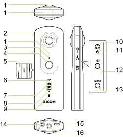
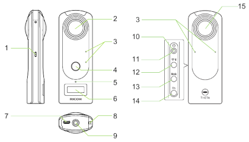
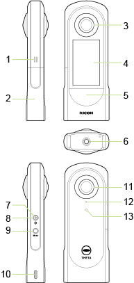

# How to Develop

### Contents

<ul>
<li><a href="#preparation-of-development-environment-and-debugging" onclick="ga('send','event','link','click','Preparation_of_development_environment_and_debugging');">Preparation of development environment and debugging</a></li>
<li><a href="#names-of-camera-parts" onclick="ga('send','event','link','click','Names_of_Camera_Parts');">Names of Camera Parts</a></li>
<li><a href="#controlling-the-camera" onclick="ga('send','event','link','click','Controlling_the_Camera');">Controlling the Camera</a></li>
<li><a href="#device-control" onclick="ga('send','event','link','click','Device_Control');">Device Control</a></li>
<li><a href="#open-source-licenses" onclick="ga('send','event','link','click','Open_Source_Licenses');">Open Source Licenses</a></li>
<li><a href="#version-information" onclick="ga('send','event','link','click','Version_Information');">Version Information</a></li>
<li><a href="#specify-camera-model-support" onclick="ga('send','event','link','click','Specify_Camera_Model_Support');">Specify Camera Model Support</a></li>
<li><a href="#warnings-when-developing-plugins" onclick="ga('send','event','link','click','Warnings_When_Developing_Plugins');">Warnings When Developing Plugins</a></li>
<li><a href="#enablesdisables-the-output-of-the-debug-log-logcat" onclick="ga('send','event','link','click','Enables/Disables_the_output_of_the_debug_log_(logcat)');">Enables/Disables the output of the debug log (logcat)</a></li>
</ul>

## Preparation of development environment and debugging 

Step 1: Get RICOH THETA V, Z1 or X

* In case of RICOH THETA V, update the firmware to v2.30.1 or later to develop the plugin.

* If you are Japan residence and would like to develop plugin using RICOH THETA Z1 51GB or RICOH THETA X, please see [here](https://webform.ricoh.com/form/pub/e00101/support51gb)

Step 2: Enable developer mode with RICOH

* Register from [here](../core/products/theta-plugin.md#how-to-join-the-partner-program) to enable developer mode. This step must be completed before moving on to Step 3.

Step 3: Enable THETA developer mode using the RICOH desktop application on Mac or Windows

* In the File menu go to Developer Mode, set to ON

Step 4: Install Android&trade; Studio

Step 5: Connect RICOH THETA V, Z1 or X with USB

Step 6: Enter `adb devices` from terminal and ready when the device name appears

Step 7: Download [RICOH THETA Plugin SDK](https://github.com/ricohapi/theta-plugin-sdk)

Step 8: Develop THETA plugin, which is the Android&trade; application, based on SDK

Step 9: Debugging with the Run button etc. With this step, the THETA plugin is executed by installing the APK.

## Names of Camera Parts

### RICOH THETA V



1. Microphone

2. Lens

3. Camera Status Light (LED2)

4. Shutter Button

5. Speaker

6. Wireless Light (LED3)

7. Capture Mode Light (LED4, LED5, LED6)

8. Video Recording Light (LED7)

9. Memory Warning Light (LED8)

10. Power Light (LED1)

11. Power Button

12. Wireless Button

13. Mode Button

14. Microphone Jack

15. USB Port

16. Tripod Mount Hole

### RICOH THETA Z1



1. Speaker

2. Rear lens

3. Microphone

4. Shutter Button

5. Camera Status Light (LED2)

6. OLED

7. USB Port

8. Wrist Strap Attachment

9. Tripod Mount Hole

10. Power Light (LED1)

11. Power Button

12. Wireless Button

13. Mode Button

14. Fn Button

15. Front lens

### RICOH THETA X



1. Speaker

2. Battery/card cover

3. Rear lens

4. LCD panel

5. Shutter button

6. Tripod mount hole

7. Power lamp

8. Power button

9. Mode button

10. USB terminal (USB Type-C)

11. Front lens

12. Microphone

13. Camera status lamp

## Controlling the Camera

Plugins can take pictures using the [Web API](./web-api.md) or the [Camera API](./camera-api.md). When using the Camera API with a plugin, the Web API can not be used.

## Device Control

Plugin app can send RICOH THETA specified Broadcast Intent to use several functions ; sucn as controlling LED/OLED, controlling WLAN mode, sounds SE, etc. See also  [Broadcast Intent](./broadcast-intent.md) for detail.

## Open Source Licenses

By placing the open source license information used by the plugin in the plugin (APK file) \assets\licenses.html, you can acquire the license information using the Web API camera._getPluginLicense command. In case of no open source softwares in the plugin, please use the following code:

```html
<html>
  <head>
    <meta http-equiv="Content-Type" content="text/html; charset=windows-1252">
    <style type="text/css">
      body { padding: 0; font-family: sans-serif; }
    </style>
  </head>
  <body topmargin="0" leftmargin="0" rightmargin="0" bottommargin="0">
    <div>
      <p>This plugin does not use open source software.</p>
    </div>
  </body>
</html>
```

## Version Information

The version of the plugin is designed using a number and a decimal point, with the major version using 2 digits or less, the minor version using 2 digits or less, and the build number using 4 digits or less. For example: "12.34.5678"

## Specify Camera Model Support

The plugin must specify the camera model that it will run on.
The plugin can only be installed on the camera model specified in your manifest.
Please use the following syntax to declare the camera model in your AndroidManifest.xml file.
For RICOH THETA X (FW1.00.2), write the THETA X model specification in the first line.

~~~
<uses-feature android:name="com.theta360.receptor.x" android:required=["true" | "false"]/>
<uses-feature android:name="com.theta360.receptor.z1" android:required=["true" | "false"]/>
<uses-feature android:name="com.theta360.receptor.v" android:required=["true" | "false"]/>
~~~

If the plugin does not support RICOH THETA V, Z1 and only supports RICOH THETA X, please declare the following
in your AndroidManifest.xml file. 

~~~
<uses-feature android:name="com.theta360.receptor.x" android:required="true"/>
<uses-feature android:name="com.theta360.receptor.z1" android:required="false"/>
<uses-feature android:name="com.theta360.receptor.v" android:required="false"/>
~~~

## Warnings When Developing Plugins

* To install the developed plugin on RICOH THETA V/Z1/X you need to enable ADB. Please register as a developer with RICOH and enable ADB according to the documentation. (Please be patient as we are planning to release the developer registration mechanism and effective ADB usage techniques in the near future.)
* Please limit the size of the plugin to 256MB
* Plugin and package names cannot exceed 64 characters and an extension must use apk
* Version number must follow the [versioning information](#version-information)
* Use of [open source licenses](#open-source-licenses) must be explicitly stated
* You cannot start a service
* When you press and hold the mode button for 2 seconds or more, the plugin must terminate. With the RICOH THETA X, even if an ACTION_FINISH_PLUGIN is issued, no force-stop of the plugin APK from the main camera app side is performed, so onPause() or finish() must be used to close.
* When the plugin is terminated, the plugin must give a [notification of termination for the plugin](./broadcast-intent.md#notifying-completion-of-plugin)

## Enables/Disables the output of the debug log (logcat)

For RICOH THETA Z1 (firmware version 1.50.1 or later) and RICOH THETA X (firmware version 1.20.0 or later), the debug log (logcat) is not output by default.  
Use the following ADB command to output the debug log (logcat).  
Note that the power consumption will increase when the debug log (logcat) is output.  

Log output enabled
```
adb shell setprop persist.log.tag 0
```

Log output disabled
```
adb shell setprop persist.log.tag A
```
